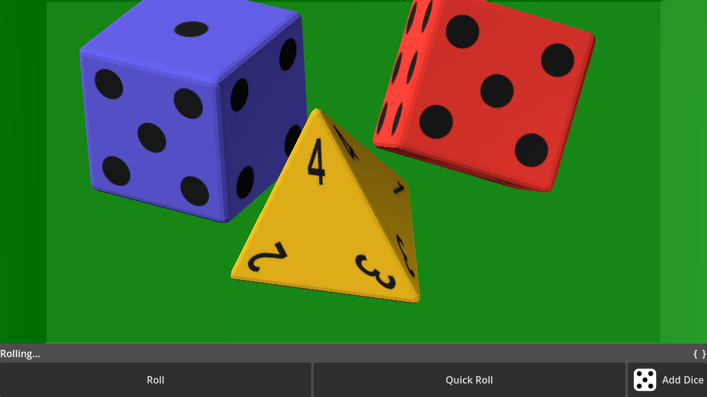
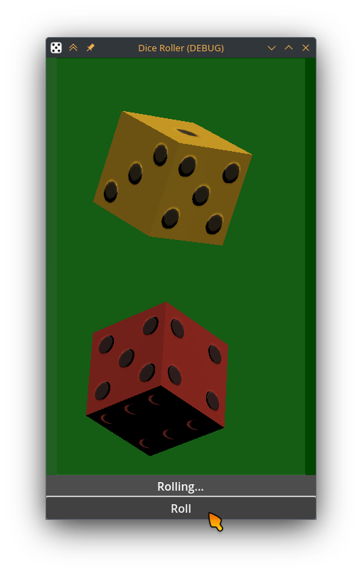
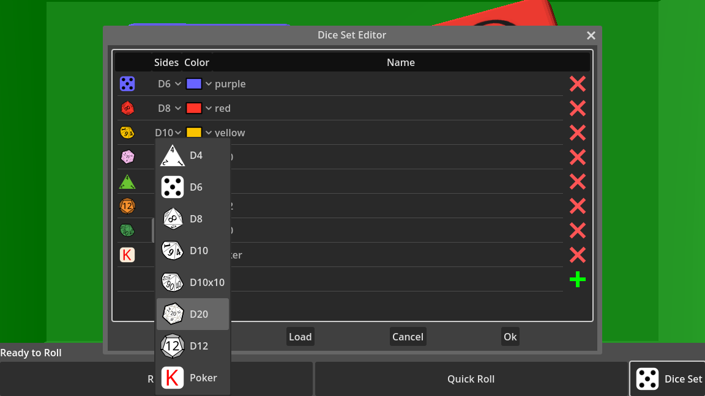
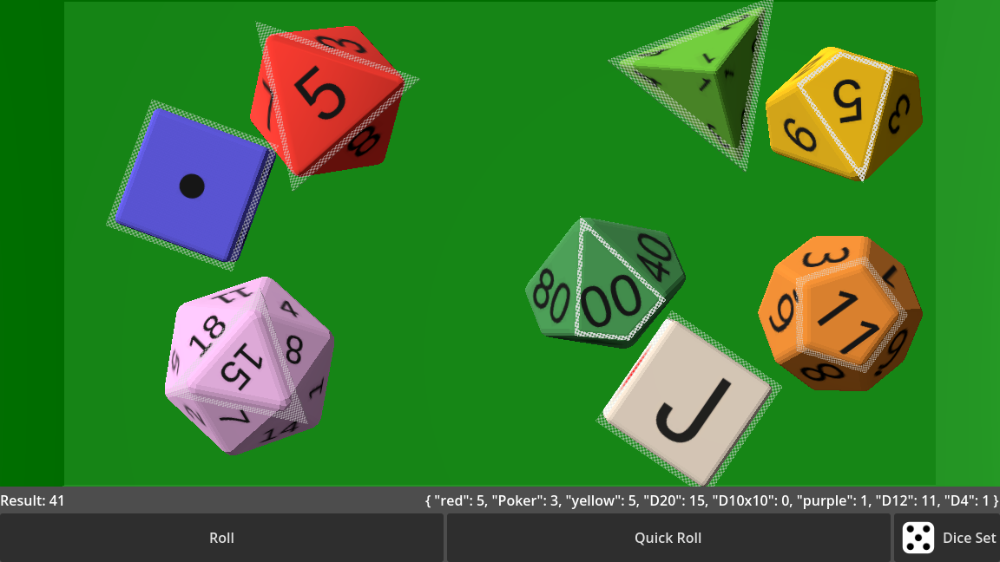
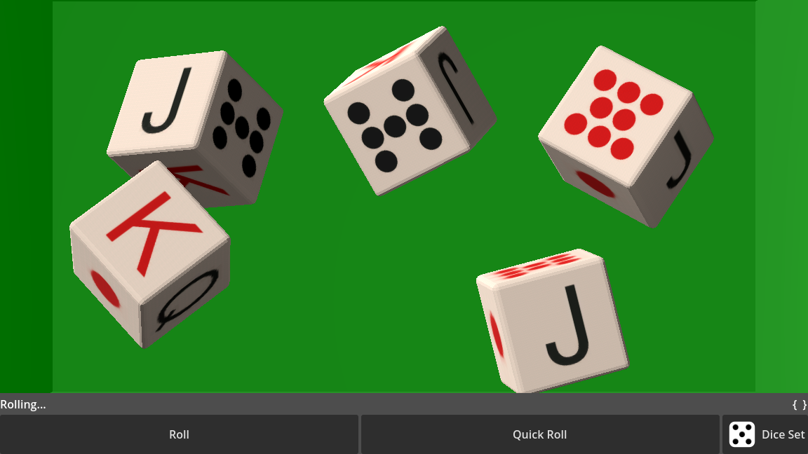

<!--  -->
<!-- [][] -->

# godot-dice-roller

Rolls 3D dices in a box.

- Customizable: shape, color, face engravings, material, box color...
- Available dice shapes: d4, d6, d8, d10, d10x10, d12, d20, poker dices.
- Physics based rolling, quick rolling or, for network games, external rolling.
- Straight forward integration as addon in your own Godot game.

Documentation: https://github.com/vokimon/godot-dice-roller/blob/main/docs

